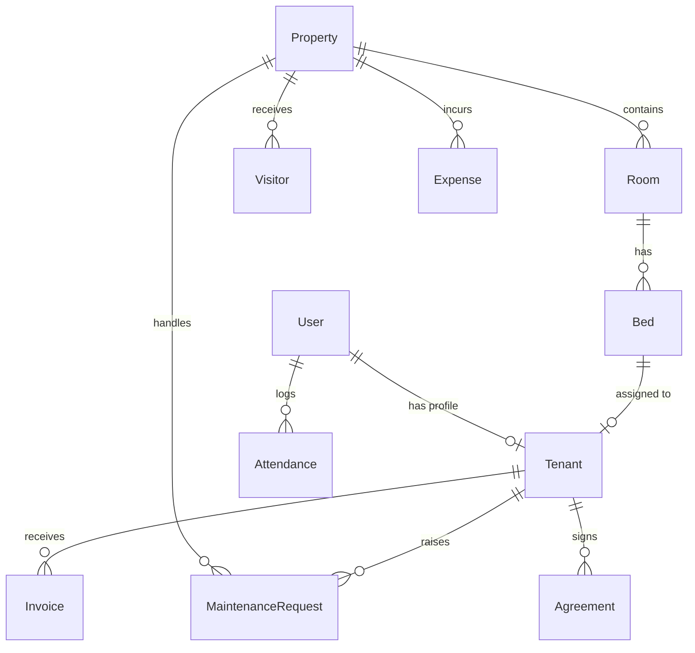

# 🏠 StaySphere — Complete Project Documentation

This document provides a comprehensive technical guide to **StaySphere**, a modern PG (Paying Guest) & Hostel Management System. It explains the system architecture, database design, API specification, user flows, and local setup instructions.

---

## 📋 Table of Contents
1. [Executive Summary](#1-executive-summary)
2. [Product Modules & Business Logic](#2-product-modules--business-logic)
3. [System Architecture & Technology Stack](#3-system-architecture--technology-stack)
4. [Database Schema & Entity Relationships](#4-database-schema--entity-relationships)
5. [RESTful API Endpoint Reference](#5-restful-api-endpoint-reference)
6. [User Interface & Page Walkthrough](#6-user-interface--page-walkthrough)
7. [Installation & Deployment Guide](#7-installation--deployment-guide)
8. [Conclusion & Future Roadmap](#8-conclusion--future-roadmap)

---

## 1. Executive Summary

### The Problem
PG and hostel administrators deal with several manual operational overheads:
* **Occupancy Management**: Keeping track of which beds are occupied, vacant, or under maintenance is often done via spreadsheets, leading to booking errors.
* **Billing & Payments**: Writing invoices, checking who paid rent, and sending payment links manually takes significant time.
* **Security & Logs**: Paper logbooks for property visitors and tenant attendance are difficult to search and secure.
* **Maintenance Tracker**: Verbal complaints or chat messages get lost, leading to unresolved issues and tenant dissatisfaction.

### The StaySphere Solution
**StaySphere** is a role-based, full-stack application designed to automate property management. It provides a visual dashboard for owners to track revenue, occupancy, and expenses, an interactive bed allocator, automated billing, a digital signature pad for lease agreements, a maintenance tracker, and check-in security logs.

---

## 2. Product Modules & Business Logic

### 🔐 2.1 Role-Based Access Control (RBAC)
StaySphere segments operations by user permissions:
* **Super Admin**: Views global usage statistics across all properties and manages platform users.
* **Owner**: Manages their registered properties, adds rooms/beds, registers tenants, issues invoices, and views financial reports.
* **Staff**: Handles daily operations (visitor logging, check-in checks, and updating maintenance ticket statuses).
* **Tenant**: Views their allocated room and bed, pays monthly invoices, files maintenance tickets, and signs rental agreements.

### 🛏️ 2.2 Room & Bed Allocation
Rather than managing properties as raw buildings, StaySphere maps them to individual rooms and beds. 
* Creating a room with a specified capacity (e.g., Double room 101) automatically spawns the corresponding beds (e.g., `101-A` and `101-B`).
* Beds change color based on their status: **Green** (Vacant), **Red** (Occupied), or **Yellow** (Under Maintenance).

### 💰 2.3 Rent & Razorpay Integration
* **Auto-Billing**: Invoices are generated for active tenants at the beginning of each billing cycle.
* **Simulated Payments**: Tenants trigger payments in React, displaying a simulated Razorpay checkout window. On completion, the frontend submits the payment signature, order ID, and transaction token to the FastAPI backend, which validates the credentials and marks the invoice as `paid`.

### 🔧 2.4 Maintenance Ticket Flow
1. **Tenant** creates a ticket with details (e.g., "Leaking sink in Room 202"), category (Plumbing, Electrical, etc.), and priority (Low, Medium, High).
2. **Staff/Owner** receives the ticket on their dashboard and assigns it to an operational staff member.
3. The assignee updates the ticket state from `pending` to `in_progress` and finally `resolved`, keeping the tenant notified at each step.

### 👁️ 2.5 Security Logbooks & Visitor Tracker
Staff log all external visitors entering the premises. The system records:
* Visitor's name, phone, purpose of visit, and check-in timestamp.
* An optional check-out action updates the database with the check-out timestamp, helping maintain an accurate logs database.

---

## 3. System Architecture & Technology Stack

The application is structured into decoupled layers:

```
[React SPA Client] <--- HTTPS / JSON (JWT Auth) ---> [FastAPI App Server] <--- ORM (SQLAlchemy) ---> [SQLite / PostgreSQL]
       |                                                    |
       v                                                    v
[Cloudinary SDK] (Images/Signatures)             [Razorpay Client] (Simulated Checkout)
```

### 💻 3.1 Frontend (React + TypeScript)
* **Vite**: Rapid, HMR-enabled module builder.
* **TypeScript**: Enforces typing, reducing runtime crashes.
* **Tailwind CSS**: A utility-first styling framework used to create the responsive user interface.
* **React Router DOM**: Manages client-side routing, handling transitions between public (login, signup) and protected layouts.
* **Axios**: HTTP client equipped with interceptors that automatically attach JWT tokens to request headers and redirect on session expiration.
* **Recharts & Framer Motion**: Utilized to render interactive dashboard summaries and animated page transitions.

### ⚙️ 3.2 Backend (FastAPI + SQLAlchemy)
* **FastAPI**: Asynchronous web framework leveraging Pydantic for validation and automatic Swagger UI page output.
* **SQLAlchemy 2.0**: Object Relational Mapper (ORM) handling SQL schema execution and relation mappings.
* **SQLite**: Used for local development (configured out-of-the-box as a file database).
* **PostgreSQL**: Supported for production environments by changing the `DATABASE_URL` environment variable.

---

## 4. Database Schema & Entity Relationships

The relational schema maps out the PG/Hostel database structure. Standard SQLAlchemy configurations handle cascading deletes (e.g., deleting a room deletes all child beds, but unbinds tenants to keep historical statistics intact).



### 🗄️ 4.1 Database Tables Configuration

#### 1. `users` Table
Stores authentication accounts:
* `id` (INTEGER, Primary Key)
* `email` (VARCHAR, Unique, Indexed)
* `hashed_password` (VARCHAR, Securely encrypted)
* `full_name` (VARCHAR)
* `role` (VARCHAR: `super_admin`, `owner`, `staff`, `tenant`)
* `status` (VARCHAR: `active`, `inactive`)
* `created_at` (TIMESTAMP)

#### 2. `properties` Table
Registered PG/Hostel accommodations:
* `id` (INTEGER, Primary Key)
* `name` (VARCHAR)
* `address` (VARCHAR)
* `type` (VARCHAR: `pg`, `hostel`, `flat`)
* `amenities` (VARCHAR: comma-separated values)
* `owner_id` (INTEGER, Foreign Key referencing `users.id`)

#### 3. `rooms` Table
* `id` (INTEGER, Primary Key)
* `room_number` (VARCHAR)
* `floor` (INTEGER)
* `room_type` (VARCHAR: `single`, `double`, `triple`, `quad`)
* `price_per_bed` (FLOAT)
* `capacity` (INTEGER)
* `property_id` (INTEGER, Foreign Key referencing `properties.id`, cascade delete)

#### 4. `beds` Table
* `id` (INTEGER, Primary Key)
* `bed_number` (VARCHAR)
* `status` (VARCHAR: `vacant`, `occupied`, `maintenance`)
* `room_id` (INTEGER, Foreign Key referencing `rooms.id`, cascade delete)

#### 5. `tenants` Table
Extends the tenant `User` account:
* `id` (INTEGER, Primary Key)
* `user_id` (INTEGER, Foreign Key referencing `users.id`)
* `bed_id` (INTEGER, Foreign Key referencing `beds.id`, nullable)
* `emergency_contact` (VARCHAR)
* `guardian_name` (VARCHAR)
* `guardian_phone` (VARCHAR)
* `lease_start` (DATE)
* `lease_end` (DATE)

#### 6. `invoices` Table
* `id` (INTEGER, Primary Key)
* `tenant_id` (INTEGER, Foreign Key referencing `tenants.id`)
* `amount` (FLOAT)
* `month` (VARCHAR: e.g., "July 2026")
* `due_date` (DATE)
* `status` (VARCHAR: `paid`, `pending`, `overdue`)
* `paid_at` (TIMESTAMP, Nullable)

#### 7. `agreements` Table
* `id` (INTEGER, Primary Key)
* `tenant_id` (INTEGER, Foreign Key referencing `tenants.id`)
* `content` (TEXT: Legal terms)
* `status` (VARCHAR: `pending`, `signed`)
* `signature_url` (VARCHAR: Base64 data or Cloudinary URL)
* `signed_at` (TIMESTAMP, Nullable)

---

## 5. RESTful API Endpoint Reference

All payloads submit JSON structures. Errors return standard HTTP status codes (`400`, `401`, `403`, `404`) with error details matching:
```json
{
  "detail": "Error explanation string"
}
```

### 5.1 Authentication API (`/api/v1/auth`)
* `POST /api/v1/auth/signup` -> Registers user.
* `POST /api/v1/auth/login` -> Authenticates email and password. Returns access token:
  ```json
  {
    "access_token": "eyJ...",
    "token_type": "bearer",
    "role": "owner",
    "full_name": "John Doe",
    "email": "owner@example.com",
    "user_id": 1
  }
  ```

### 5.2 Room Operations API (`/api/v1/rooms`)
* `POST /api/v1/rooms/property/{property_id}` -> Creates room and automatically instantiates the corresponding beds.
* `PUT /api/v1/rooms/beds/{bed_id}/status` -> Updates bed status (e.g., changes status to `maintenance`).

### 5.3 Tenant Management API (`/api/v1/tenants`)
* `POST /api/v1/tenants/register` -> Creates a tenant profile, registers the user, allocates the bed, and marks the bed status as `occupied` in a single transaction.

---

## 6. User Interface & Page Walkthrough

### 6.1 Owner's Dashboard
An all-in-one panel detailing:
* **Metric Cards**: Total monthly income, active occupancy rates, pending maintenance count, and overdue bills.
* **Collection Chart**: A responsive bar chart comparing monthly billing collection with expenses.
* **Activity Logs Feed**: Shows updates on visitor check-ins, signed leases, and new check-ins.

### 6.2 Bed Visualizer & Room Manager
* Displays rooms as structured grid cards.
* Shows bed units as interactive color chips.
* Allows owners to click a green vacant bed chip to open the Onboard Tenant form.

### 6.3 Digital Signature Panel
* Renders the generated contract lease inside a clean modal.
* Provides an HTML5 canvas signatures board for the tenant to sign.
* Saves and uploads the signature to update the status to `signed`.

---

## 7. Installation & Deployment Guide

Follow these steps to run the application locally:

### 7.1 Backend Setup
```bash
# Navigate to the backend directory
cd backend

# Create virtual environment
python -m venv .venv
# Activate venv (Windows)
.venv\Scripts\activate
# Activate venv (macOS/Linux)
source .venv/bin/activate

# Install dependencies
pip install -r requirements.txt

# Copy env template and customize settings
cp .env.example .env

# Run development server
python -m uvicorn app.main:app --reload --port 8000
```
> View the live API Swagger dashboard at: `http://localhost:8000/docs`

### 7.2 Frontend Setup
```bash
# Open a new terminal and navigate to the frontend directory
cd frontend

# Install packages
npm install

# Run Vite development server
npm run dev
```
> Open your browser and navigate to: `http://localhost:5173`

---

## 8. Conclusion & Future Roadmap

StaySphere streamlines property management by automating manual tasks. The modular structure of the frontend and backend makes it easy to add future features, such as:
1. **Automated WhatsApp Alerts**: Sending invoices and notifications directly to tenants' phone numbers.
2. **Actual Razorpay API Live Checkout**: Moving from simulated transactions to real payment processing.
3. **Biometric Integration**: Linking physical fingerprint scanners or RFID gates to check attendance and security check-ins.
