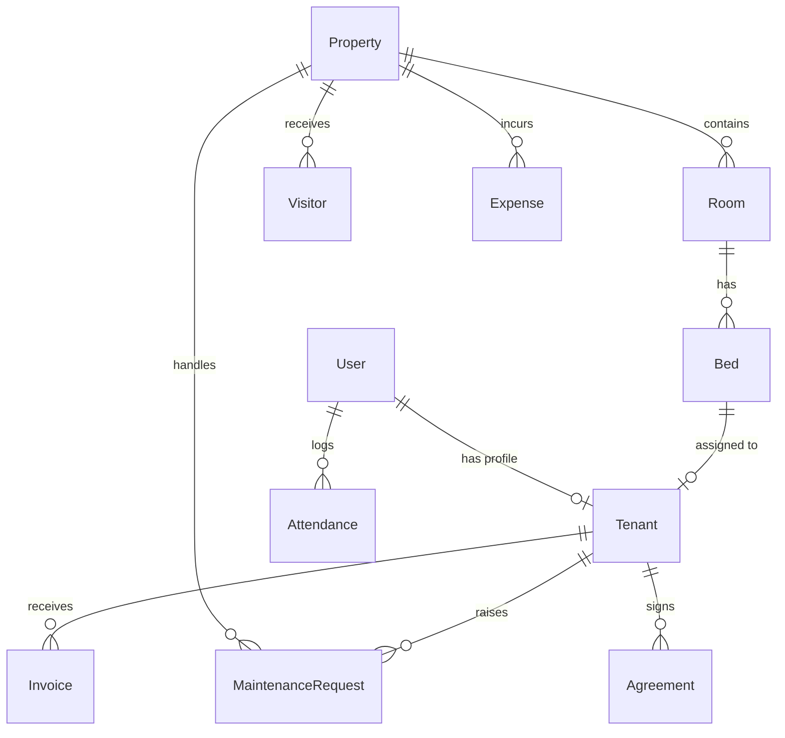

# StaySphere Backend API Documentation

> **Base URL:** `http://localhost:8000`  
> **API Prefix:** `/api/v1`  
> **Live Swagger UI:** [http://localhost:8000/docs](http://localhost:8000/docs)  
> **Auth Method:** Bearer Token (JWT)

---

## 🏗️ Tech Stack

| Layer | Technology |
|-------|-----------|
| Framework | FastAPI 0.110+ |
| ORM | SQLAlchemy 2.0 |
| Database | SQLite (dev) / PostgreSQL (prod) |
| Auth | JWT via `python-jose` + `passlib[bcrypt]` |
| Validation | Pydantic v2 |
| Payments | Razorpay (simulated) |
| File Storage | Cloudinary (configurable) |

---

## 🔐 Authentication

JWT tokens are issued on login and must be sent in every protected request as:

```
Authorization: Bearer <access_token>
```

**Token expiry:** 7 days  
**Algorithm:** HS256

### User Roles

| Role | Access Level |
|------|-------------|
| `super_admin` | Full platform access |
| `owner` | Manages their own properties, rooms, tenants |
| `staff` | Operational access (rooms, maintenance, visitors) |
| `tenant` | Self-service (own invoices, maintenance, notices) |

---

## 📌 API Endpoints

---

### 1. 🔑 Authentication — `/api/v1/auth`

#### `POST /api/v1/auth/signup`
Register a new user.

**Request Body:**
```json
{
  "email": "user@example.com",
  "password": "secret123",
  "full_name": "John Doe",
  "role": "owner",
  "phone": "9876543210"
}
```

**Response `201`:**
```json
{
  "id": 1,
  "email": "user@example.com",
  "full_name": "John Doe",
  "role": "owner",
  "phone": "9876543210",
  "status": "active"
}
```

> ⚠️ If role is `tenant`, a blank tenant profile is auto-created.

---

#### `POST /api/v1/auth/login`
Login with email + password (OAuth2 form).

**Form Data:** `username`, `password`

**Response `200`:**
```json
{
  "access_token": "eyJ...",
  "token_type": "bearer",
  "role": "owner",
  "full_name": "John Doe",
  "email": "user@example.com",
  "user_id": 1
}
```

---

#### `GET /api/v1/auth/me` 🔒
Get currently authenticated user profile.

#### `POST /api/v1/auth/forgot-password`
Simulate sending a password reset email.

#### `POST /api/v1/auth/reset-password`
Reset password using email + new password.

---

### 2. 🏠 Properties — `/api/v1/properties`

#### `GET /api/v1/properties` 🔒
List all properties. `super_admin` sees all; `owner` sees only their own.

#### `POST /api/v1/properties` 🔒 *(owner, super_admin)*
Create a new property.

**Request Body:**
```json
{
  "name": "Green Palms PG",
  "address": "42, MG Road, Bangalore",
  "type": "pg",
  "amenities": "WiFi,AC,Laundry",
  "images": "https://..."
}
```

#### `GET /api/v1/properties/{property_id}` 🔒
Get a single property by ID.

#### `PUT /api/v1/properties/{property_id}` 🔒 *(owner, super_admin)*
Update a property. Owners can only edit their own.

#### `DELETE /api/v1/properties/{property_id}` 🔒 *(owner, super_admin)*
Delete a property.

---

### 3. 🛏️ Rooms & Beds — `/api/v1/rooms`

#### `GET /api/v1/rooms/property/{property_id}` 🔒
Get all rooms for a property.

#### `POST /api/v1/rooms/property/{property_id}` 🔒 *(owner, staff, super_admin)*
Create a room. Beds are **auto-generated** based on `capacity`.

**Request Body:**
```json
{
  "room_number": "101",
  "floor": 1,
  "room_type": "double",
  "price_per_bed": 8000.0,
  "capacity": 2
}
```

> Room types: `single`, `double`, `triple`, `quad`

#### `PUT /api/v1/rooms/{room_id}` 🔒 *(owner, staff, super_admin)*
Update room details.

#### `DELETE /api/v1/rooms/{room_id}` 🔒 *(owner, super_admin)*
Delete a room and all its beds.

#### `GET /api/v1/rooms/{room_id}/beds` 🔒
List all beds in a room.

#### `GET /api/v1/rooms/beds/available` 🔒
List all vacant beds across the platform.

#### `PUT /api/v1/rooms/beds/{bed_id}/status` 🔒 *(owner, staff, super_admin)*
Update bed status. Valid values: `vacant`, `occupied`, `maintenance`.

---

### 4. 👥 Tenants — `/api/v1/tenants`

#### `GET /api/v1/tenants` 🔒
List all tenants. Supports query params:
- `?search=<name/email/phone>`
- `?status_filter=active`

#### `POST /api/v1/tenants/register` 🔒 *(owner, staff, super_admin)*
Register a new tenant and allocate a bed.

**Request Body:**
```json
{
  "email": "tenant@example.com",
  "password": "pass123",
  "full_name": "Riya Sharma",
  "phone": "9123456789",
  "bed_id": 3,
  "emergency_contact": "9876543210",
  "guardian_name": "Mr. Sharma",
  "guardian_phone": "9988776655"
}
```

#### `GET /api/v1/tenants/{tenant_id}` 🔒
Get a specific tenant profile.

#### `PUT /api/v1/tenants/{tenant_id}` 🔒
Update tenant details (emergency contact, guardian, status, KYC URL).

#### `DELETE /api/v1/tenants/{tenant_id}` 🔒 *(owner, super_admin)*
Evict tenant and free up their bed.

#### `GET /api/v1/tenants/{tenant_id}/timeline` 🔒
Get audit timeline for a tenant (registration, bed allocation, etc.)

---

### 5. 💰 Rent & Invoices — `/api/v1/rent`

#### `GET /api/v1/rent/invoices` 🔒
Get invoices. `tenant` role sees only their own. Supports `?status_filter=pending`.

#### `POST /api/v1/rent/invoices` 🔒 *(owner, staff, super_admin)*
Create a manual invoice.

**Request Body:**
```json
{
  "tenant_id": 1,
  "amount": 8000.0,
  "due_date": "2026-08-01T00:00:00"
}
```

#### `POST /api/v1/rent/invoices/generate-monthly` 🔒 *(owner, staff, super_admin)*
Auto-generate invoices for **all active tenants** with allocated beds (skips if pending exists).

#### `POST /api/v1/rent/invoices/{invoice_id}/pay` 🔒
Initiate payment — returns a simulated Razorpay order.

**Response:**
```json
{
  "order_id": "order_1_1720500000",
  "amount": 8000.0,
  "key_id": "rzp_test_mock_id",
  "currency": "INR",
  "description": "StaySphere Rent Payment - Invoice #1"
}
```

#### `POST /api/v1/rent/invoices/{invoice_id}/verify` 🔒
Verify payment and mark invoice as `paid`.

**Query params:** `?payment_id=pay_xxxxx`

#### `GET /api/v1/rent/invoices/{invoice_id}/receipt` 🔒
Get receipt data for a paid invoice.

---

### 6. 🔧 Maintenance — `/api/v1/maintenance`

#### `GET /api/v1/maintenance` 🔒
Get tickets. `tenant` sees own tickets; `staff` sees assigned/unassigned.  
Supports: `?status_filter=pending`, `?priority_filter=high`

#### `POST /api/v1/maintenance` 🔒 *(tenant only)*
Raise a maintenance complaint.

**Request Body:**
```json
{
  "property_id": 1,
  "title": "Leaking tap",
  "description": "The bathroom tap has been leaking for 2 days.",
  "priority": "high",
  "image_url": "https://..."
}
```

> Priority values: `low`, `medium`, `high`  
> Status values: `pending`, `in_progress`, `resolved`

#### `PUT /api/v1/maintenance/{request_id}` 🔒 *(owner, staff, super_admin)*
Update ticket status, priority, notes, or assign staff.

**Request Body:**
```json
{
  "status": "in_progress",
  "priority": "high",
  "resolution_notes": "Plumber scheduled for tomorrow.",
  "assigned_staff_id": 4
}
```

#### `DELETE /api/v1/maintenance/{request_id}` 🔒 *(owner, super_admin)*
Delete a maintenance ticket.

---

### 7. 👁️ Visitors — `/api/v1/visitors`

#### `GET /api/v1/visitors` 🔒
List all visitors. Filter with `?property_id=1`.

#### `POST /api/v1/visitors` 🔒 *(owner, staff, super_admin)*
Log a new visitor entry.

**Request Body:**
```json
{
  "property_id": 1,
  "name": "Arjun Kumar",
  "phone": "9000012345",
  "purpose": "Personal visit"
}
```

#### `PUT /api/v1/visitors/{visitor_id}/checkout` 🔒 *(owner, staff, super_admin)*
Record visitor exit time and mark as `checked_out`.

---

### 8. 📅 Attendance — `/api/v1/attendance`

#### `GET /api/v1/attendance` 🔒
Get attendance logs. `tenant`/`staff` see only their own. Filter with `?user_id=<id>`.

#### `POST /api/v1/attendance/check-in` 🔒
Check in for today. Marks as `late` if after 10:00 AM UTC.

#### `POST /api/v1/attendance/check-out` 🔒
Check out — records exit time for today's active session.

---

### 9. 📢 Notice Board — `/api/v1/notices`

#### `GET /api/v1/notices` 🔒
Get all notices — pinned notices appear first, sorted by newest.

#### `POST /api/v1/notices` 🔒 *(owner, staff, super_admin)*
Create a notice/announcement.

**Request Body:**
```json
{
  "title": "Water Supply Interruption",
  "content": "Water will be unavailable on July 15th from 9AM-1PM.",
  "type": "announcement",
  "is_pinned": true
}
```

> Notice types: `announcement`, `event`, `emergency`

#### `PUT /api/v1/notices/{notice_id}` 🔒 *(owner, staff, super_admin)*
Update a notice.

#### `DELETE /api/v1/notices/{notice_id}` 🔒 *(owner, staff, super_admin)*
Delete a notice.

---

### 10. 💸 Expenses — `/api/v1/expenses`

#### `GET /api/v1/expenses` 🔒 *(owner, staff, super_admin)*
List all expenses. Filter with `?property_id=1&category=electricity`.

#### `POST /api/v1/expenses` 🔒 *(owner, staff, super_admin)*
Log a new expense.

**Request Body:**
```json
{
  "property_id": 1,
  "category": "electricity",
  "amount": 4500.0,
  "description": "July electricity bill",
  "receipt_url": "https://..."
}
```

> Categories: `maintenance`, `salary`, `electricity`, `water`, `other`

#### `DELETE /api/v1/expenses/{expense_id}` 🔒 *(owner, super_admin)*
Delete an expense record.

---

### 11. 📄 Agreements — `/api/v1/agreements`

#### `GET /api/v1/agreements` 🔒
Get agreements. `tenant` sees only their own.

#### `POST /api/v1/agreements` 🔒 *(owner, staff, super_admin)*
Create a digital rental agreement for a tenant.

**Request Body:**
```json
{
  "tenant_id": 1,
  "content": "This agreement is made between...",
  "agreement_pdf_url": "https://..."
}
```

> Agreement status auto-set to `pending_signature`

#### `PUT /api/v1/agreements/{agreement_id}/sign` 🔒 *(tenant only)*
Tenant digitally signs an agreement.

**Request Body:**
```json
{
  "signature_img_url": "https://cloudinary.com/sig_riya.png"
}
```

> Status becomes `active`, `signed_at` timestamp saved.

---

### 12. 📊 Reports & Dashboard — `/api/v1/reports`

#### `GET /api/v1/reports/dashboard-stats` 🔒
Returns role-aware dashboard stats.

**For `owner` / `super_admin` / `staff` — Response:**
```json
{
  "metrics": {
    "total_properties": 3,
    "total_rooms": 24,
    "total_beds": 72,
    "occupied_beds": 58,
    "vacant_beds": 14,
    "monthly_revenue": 464000.0,
    "pending_rent": 48000.0,
    "maintenance_requests": 5,
    "visitors_today": 3
  },
  "revenue_chart": [...],
  "occupancy_chart": [...],
  "recent_payments": [...]
}
```

**For `tenant` — Response:**
```json
{
  "pending_rent": 8000.0,
  "active_complaints": 1,
  "room_number": "101",
  "bed_number": "101-A",
  "status": "active"
}
```

---

## 🗄️ Database Models



| Model | Table | Key Fields |
|-------|-------|-----------|
| `User` | `users` | `email`, `role`, `status` |
| `Property` | `properties` | `name`, `address`, `type`, `owner_id` |
| `Room` | `rooms` | `room_number`, `room_type`, `price_per_bed`, `capacity` |
| `Bed` | `beds` | `bed_number`, `status` (vacant/occupied/maintenance) |
| `Tenant` | `tenants` | `user_id`, `bed_id`, `status`, `lease_start/end` |
| `Invoice` | `invoices` | `amount`, `status`, `due_date`, `paid_at` |
| `MaintenanceRequest` | `maintenance_requests` | `title`, `status`, `priority`, `assigned_staff_id` |
| `Visitor` | `visitors` | `name`, `phone`, `purpose`, `entry_time`, `exit_time` |
| `Attendance` | `attendances` | `user_id`, `check_in`, `check_out`, `status` |
| `Notice` | `notices` | `title`, `type`, `is_pinned` |
| `Expense` | `expenses` | `category`, `amount`, `date` |
| `Agreement` | `agreements` | `content`, `status`, `signed_at` |

---

## ⚙️ Configuration

Set these environment variables for production:

| Variable | Default | Purpose |
|----------|---------|---------|
| `SECRET_KEY` | `staysphere_super_secret_jwt_key...` | JWT signing key |
| `DATABASE_URL` | `sqlite:///./staysphere.db` | Database connection |
| `CLOUDINARY_CLOUD_NAME` | `mock_cloud` | Image uploads |
| `CLOUDINARY_API_KEY` | `mock_key` | Cloudinary auth |
| `CLOUDINARY_API_SECRET` | `mock_secret` | Cloudinary auth |
| `RAZORPAY_KEY_ID` | `rzp_test_mock_id` | Payment gateway |
| `RAZORPAY_KEY_SECRET` | `rzp_test_mock_secret` | Payment gateway |

---

## 🚀 Running the Backend

```bash
# Install dependencies
pip install -r requirements.txt

# Start development server
python -m uvicorn app.main:app --reload --port 8000
```

> The backend auto-creates all database tables on startup via `Base.metadata.create_all()`.

---

## 🛡️ Error Response Format

All errors follow FastAPI's standard format:

```json
{
  "detail": "Human-readable error message"
}
```

| Status Code | Meaning |
|-------------|---------|
| `400` | Bad request / validation error |
| `401` | Unauthorized (invalid/missing token) |
| `403` | Forbidden (insufficient role) |
| `404` | Resource not found |
| `422` | Unprocessable entity (Pydantic validation) |
| `500` | Internal server error |
